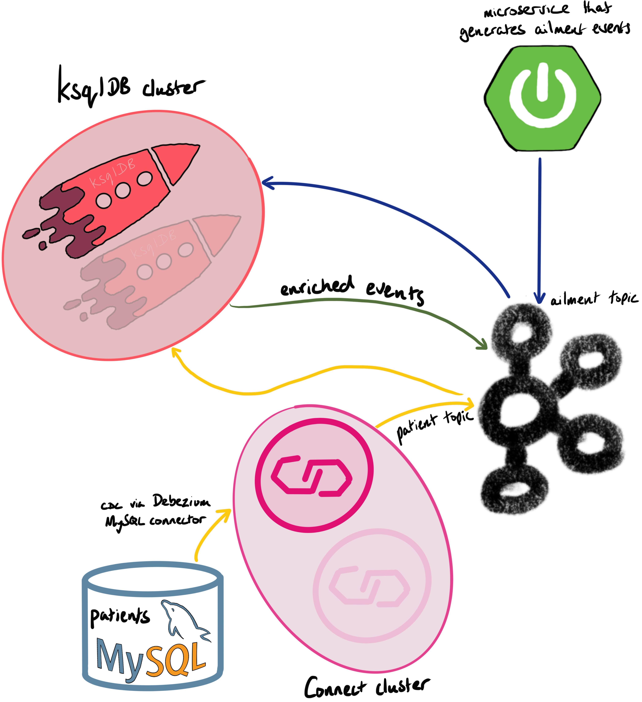
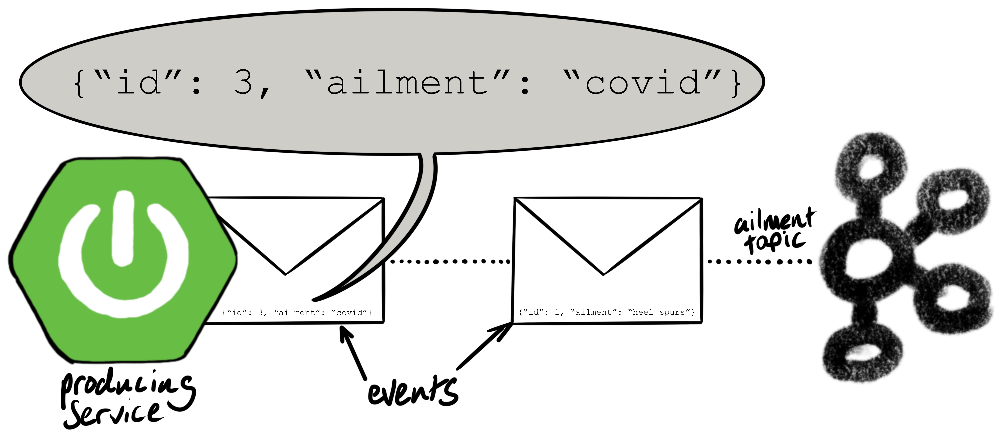

# confluent-healthcare-coverage-demo

The application generates a stream of JSON-formatted hypothetical illnesses to the `ailments` topic:

Here's some example output:

    [root@cp01 ~]# kafka-console-consumer --bootstrap-server cp01.woolford.io:9092 --topic ailment
    {"id":1,"ailment":"heel spurs"}
    {"id":2,"ailment":"covid"}
    {"id":5,"ailment":"chronic xenophobia"}
    {"id":1,"ailment":"mythomania"}
    {"id":3,"ailment":"diabetes"}
    {"id":7,"ailment":"ischemic heart disease"}
    {"id":7,"ailment":"androgenetic alopecia"}
    {"id":1,"ailment":"chronic xenophobia"}
    {"id":3,"ailment":"schizoaffective disorder"}
    ^CProcessed a total of 9 messages

The `id` is a unique identifier for the patient. The patients and ailments are generated from data that's staged in MySQL. The tables are automatically created, using Flyway, when the app is launched.

Once the ailment data is flowing in Kafka, we create a stream in ksqlDB:

    CREATE STREAM AILMENT (
      id STRING KEY,
      ailment VARCHAR
    ) WITH (
      kafka_topic='ailment',
      value_format='JSON'
    );

The application creates tables in a MySQL database. The [MySQL Debezium connector](https://debezium.io/documentation/reference/1.2/connectors/mysql.html) is used to capture the changes from the MySQL binlogs and write them to a Kafka topic. Here's the config:

    http PUT http://cp01.woolford.io:8083/connectors/mysql-cdc-healthcare/config  <<< '
    {
        "connector.class": "io.debezium.connector.mysql.MySqlConnector",
        "key.converter": "org.apache.kafka.connect.storage.StringConverter",
        "value.converter": "org.apache.kafka.connect.json.JsonConverter",
        "key.converter.schemas.enable": "false",
        "value.converter.schemas.enable": "false",
        "database.history.kafka.bootstrap.servers": "cp01.woolford.io:9092,cp02.woolford.io:9092,cp03.woolford.io:9092",
        "database.history.kafka.topic": "mysql-history",
        "database.hostname": "deepthought.woolford.io",
        "database.password": "V1ctoria",
        "database.port": "3306",
        "database.server.id": "1",
        "database.server.name": "deepthought",
        "database.serverTimezone": "America/Denver",
        "database.user": "root",
        "database.whitelist": "healthcare",
        "include.schema.changes": "false",
        "name": "mysql-cdc-healthcare",
        "snapshot.mode": "when_needed",
        "table.whitelist": "healthcare.patient",
        "tasks.max": "1",
        "transforms": "unwrap,HoistField",
        "transforms.unwrap.type": "io.debezium.transforms.ExtractNewRecordState",
        "transforms.HoistField.type": "org.apache.kafka.connect.transforms.ExtractField$Key",
        "transforms.HoistField.field": "id"
    }'

Once the patient data is in Kafka, we create a table in ksqlDB:

    CREATE TABLE PATIENT (
      id STRING PRIMARY KEY,
      firstname VARCHAR,
      lastname VARCHAR,
      enroll_start BIGINT,
      enroll_end BIGINT
    ) WITH (
      kafka_topic='deepthought.healthcare.patient',
      value_format='JSON'
    );

We can then join the stream and table:

    select
      ailment.id as id,
      ailment,
      firstname,
      lastname,
      ailment.rowtime as ailment_ts,
      enroll_start * 86400 * 1000 as enroll_start,
      enroll_end * 86400 * 1000 as enroll_end,
      case
        when ailment.rowtime > enroll_start * 86400 * 1000
          and ailment.rowtime <= enroll_end * 86400 * 1000
        then true
        else false
      end as covered
    from ailment inner join patient on ailment.id = patient.id emit changes;

Here's a video walk-through:

